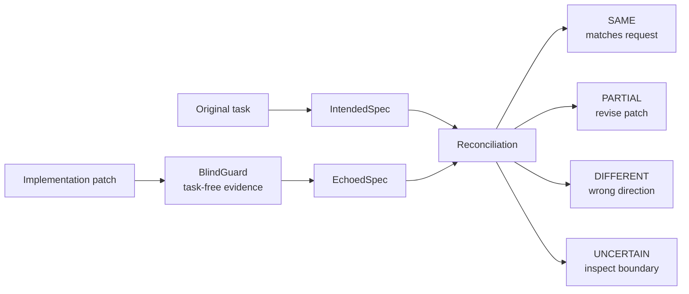

# Flect

**Hide the prompt. Read the patch.**

[](https://github.com/aakbarpour/flect/actions/workflows/ci.yml)
[](LICENSE)

Flect is an independent second opinion for AI-written patches. It reconstructs what a patch appears to do without showing the verifier the original task, then compares that reconstruction with the requested behavior.

**Tests pass. But did your coding agent build what you actually asked for?** Flect adds a separate signal for missing requirements, violated constraints, scope creep, and wrong-direction fixes. It is not a correctness oracle: review the patch, tests, and Flect's evidence together.

## Contents

- [Why Flect](#why-flect)
- [Research evidence](#-research-evidence)
- [How it works](#how-it-works)
- [Quick start](#-quick-start)
- [Choose an integration](#choose-an-integration)
- [Understand the verdicts](#understand-the-verdicts)
- [Trust and privacy](#-trust-and-privacy)
- [CLI reference](#cli-reference)
- [Documentation](#documentation)
- [Project status and limitations](#project-status-and-limitations)
- [Attribution and license](#attribution-and-license)

## Why Flect

Coding agents can produce a plausible patch while solving a nearby problem, omitting a requirement, or changing behavior outside the request. Flect makes that mismatch visible before the patch is treated as complete.

- Captures the requested task before implementation changes can bias review.
- Builds a focused, sanitized view of the patch and relevant context.
- Uses a blind reconstruction that has no task, conversation, forward specification, task-bearing Git metadata, or primary-agent reasoning.
- Compares intended behavior with apparent patch intent and returns an actionable verdict.
- Works through the Codex Skill, a Responses-compatible API, or a stdio MCP server.

## 📈 Research evidence

Flect is inspired by RETRACE, a bidirectional reconstruct-and-verify method for coding agents. The paper reports these results on its own SWE-bench Verified studies:

| Agent/model | Baseline | With RETRACE | Uplift |
| --- | ---: | ---: | ---: |
| mini-SWE-agent + GPT-5-mini | 56.2% | 63.2% | **+7.0 percentage points** |
| mini-SWE-agent + MiniMax M2.5 | 75.8% | 79.4% | **+3.6 percentage points** |

These are **RETRACE results, not Flect benchmarks**. They are evidence for the verification pattern that motivates Flect, not a guarantee of the same uplift in another product or project. Read the [paper](https://arxiv.org/abs/2608.08950) and Flect’s [research and attribution notes](docs/research.md) for methodology, authorship, and limitations.

## How it works



Flect records forward intent, independently reconstructs patch intent, and reconciles both with evidence.

## 🚀 Quick start

Use the repository marketplace plugin for the shortest path from an existing Git repository to independent verification.

1. Download and inspect the installer, then run it.

   On Linux or macOS:

   ```console
   curl --fail --location --proto '=https' --proto-redir '=https' \
     https://github.com/aakbarpour/flect/releases/latest/download/install.sh \
     --output install.sh
   sed -n '1,260p' install.sh
   sh install.sh
   ```

   On Windows PowerShell:

   ```powershell
   Invoke-WebRequest `
     -Uri https://github.com/aakbarpour/flect/releases/latest/download/install.ps1 `
     -OutFile .\install.ps1
   Get-Content .\install.ps1
   powershell -NoProfile -ExecutionPolicy Bypass -File .\install.ps1
   ```

   The installers verify `SHA256SUMS`, install into a user-local directory, and never change your PATH automatically. They print the exact PATH instruction when the destination is not already available.

2. Confirm the executable:

   ```console
   flect --version
   ```

3. Add and install the Flect plugin in Codex:

   ```console
   codex plugin marketplace add aakbarpour/flect
   codex plugin add flect@flect
   ```

   The plugin provides both the Flect Skill and a local stdio MCP server. It runs the `flect` executable already on your `PATH`; it does not download a binary. Start a new Codex task after installing so the Skill and MCP tools are loaded.

4. Enter the Git repository where an agent will make a change:

   ```console
   cd /path/to/your/repository
   ```

5. Initialize project-local configuration:

   ```console
   flect init
   ```

6. If you are using the manual Skill fallback instead of the plugin, install and check it:

   ```console
   flect skill install
   flect skill status
   ```

7. Ask Codex: **“Use Flect verification for this implementation.”** Flect captures the task, prepares the blind handoff, and validates the structured results.

8. Review the verdict and follow its recommended action. Use `flect inspect` or `flect verify --dry-run` to inspect the request boundary first.

See [installation](docs/installation.md) for archives, checksums, Windows instructions, and source-install details; see [getting started](docs/getting-started.md) for credentials, providers, troubleshooting, and the full lifecycle.

## Choose an integration

| Mode | Best for | Start here |
| --- | --- | --- |
| **Codex repository plugin** | Developers already working in Codex | `codex plugin marketplace add aakbarpour/flect`, then `codex plugin add flect@flect` |
| **Codex Skill (manual fallback)** | Environments without plugin marketplace support | `flect skill install` and ask Codex to use Flect |
| **Responses-compatible API** | Automated or provider-configured workflows | Configure `runner.kind = "api"`, then use `flect start` and `flect verify` |
| **stdio MCP (manual fallback)** | Hosts that discover tools through MCP | Register `flect mcp` with the host |

All integration paths use the same Flect application and policy. Follow [getting started](docs/getting-started.md), [model routing](docs/model-routing.md), and [MCP](docs/mcp.md) for configuration details.

## Understand the verdicts

| Verdict | Meaning | Recommended action |
| --- | --- | --- |
| `SAME` | The patch’s apparent intent matches the requested intent. | Review normally and merge through your usual process. |
| `PARTIAL` | The patch addresses part of the request but misses a requirement or constraint. | Revise the patch, then verify again. |
| `DIFFERENT` | The patch appears to solve a different problem or materially changes the requested behavior. | Stop and reassess the implementation against the task. |
| `UNCERTAIN` | Evidence, isolation, provider output, or confidence is insufficient. | Inspect the boundary and configuration; do not treat it as success. |

## 🔒 Trust and privacy

- Git capture is read-only: Flect does not commit, stage, reset, checkout, change branches, or edit Git configuration.
- BlindGuard’s strict backward request has no field for the original task, forward specification, conversation, task-bearing Git metadata, or primary-agent reasoning.
- Common secret paths, private keys, credential files, binaries, build output, vendored code, and dependency directories are excluded before bundle construction. Source and comments can still reveal intent, so inspect the exact bundle when privacy matters.
- Credentials come from the configured environment variable. Flect does not persist credential values, authorization headers, or complete provider payloads.
- Codex-native handoffs provide structural separation: a fresh verifier and judge receive only prepared resources. This is not cryptographic or operating-system isolation; a shared runtime may still expose resources outside the prepared workspace.

## CLI reference

- `flect init` — initialize configuration and project-local state.
- `flect start` — capture the original task and immutable base revision.
- `flect inspect` — show exactly what a verifier would receive without invoking a runner.
- `flect verify` — reconstruct intent, reconcile it with the task, and persist a verdict.
- `flect echo [REVISION]` — describe what a patch appears to do without an original task.
- `flect doctor` — diagnose Git, repository, configuration, and runner readiness.
- `flect config show|set KEY VALUE` — inspect or update common configuration fields.
- `flect skill install|status|uninstall` — manage the project-local Codex Skill.
- `flect mcp` — serve Flect tools over stdio MCP.

Every command supports `--json`; use `--verbose` for diagnostics. Advanced cleanup, routing, and protocol details live in the linked documentation.

## Documentation

- [Getting started](docs/getting-started.md) · [Installation](docs/installation.md)
- [Architecture](docs/architecture.md) · [Blind verification](docs/blind-verification.md)
- [Privacy model](docs/privacy.md) · [Codex MCP integration](docs/mcp.md)
- [Model routing and cost estimates](docs/model-routing.md)
- [Research and attribution](docs/research.md) · [Security policy](SECURITY.md)
- [Contributing](CONTRIBUTING.md) · [Project governance](docs/governance.md)

## Project status and limitations

Flect v0.1.0 is released. The verification pipeline, Codex repository plugin, bundled Codex Skill, Responses-compatible API mode, stdio MCP adapter, native release archives, and bootstrap installers are implemented; interfaces and defaults may evolve while Flect remains pre-1.0 software.

The API transport currently implements the Responses-style protocol; Chat Completions compatibility is not implemented. Codex-native verification depends on fresh no-parent-context handoffs, and its boundary is structural rather than a security sandbox. See [installation](docs/installation.md) for the v0.1.0 release archives and installation paths.

## Attribution and license

Flect is inspired by **Independent Patch Verification for Coding Agents with a Bidirectional Reconstruct-and-Verify Framework** (RETRACE) by Chenglin Li, Yisen Xu, Zehao Wang, Shin Hwei Tan, and Tse-Hsun (Peter) Chen. Flect does not claim to have invented that academic method or to reproduce its empirical results. See the [research notes](docs/research.md) for the full attribution.

Flect is available under the [MIT License](LICENSE).
